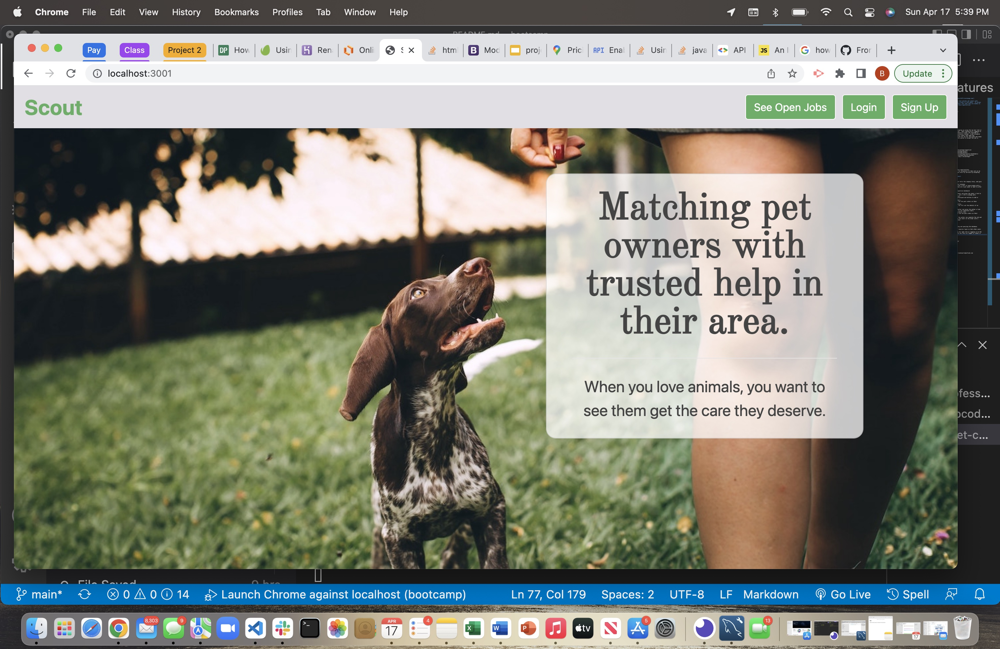

# [Welcome to Scout Pet Care]()

#### The Walks of Love is a full-stack website that matches pet owners with freelance pet care specialists looking for new friends to care about.  It allows pet owners to post opportunities to care for their pets when they are unable to and allows potential pet caregivers to accept those opportunities.

---

#### Collaborators:
*  [Brian Swartz](https://github.com/bdswartz)
*  [David Curtis](https://github.com/DavidebCurtis)
*  [Geiciane Barham](https://github.com/geicibarham)
*  [John Martin](https://github.com/gemsjohn)
*  [Rebekkah Huss](https://github.com/bekkahhuss)

---

## Installation
N/A - 

---

## Usage
A user can navigate from the landing page by signing or loggin in using the nav bar links.  Upon signing up or logging in, the user navigates to their dashboard.  On the dashboard an owner can view/add to their pets and see any jobs that they have previously created.  A pet caregiver can see all of the jobs that they have previously taken; both open and completed.  The user can refine their search criteria by providing a search radius to limit the jobs shown. The job search page is navigable from the nav bar drop down and shows open jobs.  If logged in as a pet caregiver, the option to accept the job is there.

---

## Technologies

> <b>Development Tools:</b>
  * JavaScript
  * Express.js
  * [mySQL](https://www.npmjs.com/package/mysql2)
  * node.js
    * [Sequelize package](https://www.npmjs.com/package/sequelize)
    * [dotenv package](https://www.npmjs.com/package/dotenv)
    * [express handlebars package](https://www.npmjs.com/package/express-handlebars)
    * [express-session package](https://www.npmjs.com/package/express-session)
    * [connect-session-sequelize package](https://www.npmjs.com/package/connect-session-sequelize)
    * [uniqid package](https://www.npmjs.com/package/uniqid)
    * [moment for handlebars](https://www.npmjs.com/package/handlebars.moment)
    * [geocoder npm package](https://www.npmjs.com/package/node-geocoder)
  * Bootstrap

  ---

## User Story
### AS A developer who writes about tech
I WANT a website where I can go to post pet care opportunities.
SO THAT as an owner, I can post opportunities for caregivers to take care of my pet when i am unable.  And as a caregiver I can offer my services by accepting posted opportunities to care for pets.
    
### Acceptance Criteria for Minimum Viable Product

GIVEN a pet care website:
*  When loading the app, 
    THEN open a high impact landing screen that tells the company story, and give the user the option to LOGIN or SignUp
*  When clicking on Login or Signup link on the homepage
    THEN it takes the user to a modal that allows a user to login/signup with a username and password and chose whether they are a pet owner or want to offer pet care services
*  When login or signup complete, 
    THEN it take the owner/walker to their respective dashboard
*  WHEN the owner dashboard opens, 
    THEN it displays all open orders for the owner and gives the owner a link to add an order, a link to see closed orders, and a link to manage pets.
*  WHEN the owner clicks on the manage pets link, 
    THEN the owners pets and pet details are displayed and buttons to add or delete a pet are displayed.
*  When the owner clicks on the see closed orders, 
    THEN a page is opened where the owner can see the past orders on their dashboard instead of open/future orders.
*  When the owner clicks on the “add order” button, 
    THEN the order form/page opens where they can fill out the details of an order.
*  When the walker dashboard opens
    THEN it displays all open orders for the walker and gives the walker a link to add (ie accept) a new order and a link to see completed orders.
*  When the walker clicks on the “see closed orders” link, 
    THEN a page is opened where the walker can see the past orders on their dashboard instead of open/future orders.
*  When the walker clicks on an open order, 
    THEN the order details are opened so that the walker can complete the job and a field is provided to provide feedback to the owner on the order with a button for the walker to “complete” the order.
 
---

## Features
-  Utilizes sequelize ORM to aid in creating and querying the database.
-  Uses express as the server.
-  The site maintains a database of owners and walkers and requires login so that the user experience is based on their need
-  Session data is stored upon user signing up for the site or logging in to the site.  This customizes user experience based on how they are logged in (owner or pet caregiver).
-  User address is entered upon signup.  That address is immediately converted to a latitude and longitude using the node geocoder package.  The location of the job and the location of the pert service provider is used to calculate distance from one to the other and allows a service provider to search based on proximity to the job.

<!-- ## File Architecture

<b>Click To View</b>

 

         AppBeware
         ├── Client
         │   ├── build
         │   ├── node_modules
         │   ├── public
         │   ├── src
         │   │   ├── assets
         |   │   │   ├── images
         |   │   │   ├── Readme_assets
         |   │   │   └── styling
         │   │   ├── components
         |   │   │   ├── AboutTheShields
         |   │   │   ├── AddAppReview
         |   │   │   ├── Alerts
         |   │   │   ├── AppPageComponents
         |   │   │   ├── CategoryCards
         |   │   │   ├── Footer
         |   │   │   ├── HeaderContainer
         |   │   │   ├── HomePageShieldLayout
         |   │   │   ├── HomepageTabNav
         |   │   │   ├── HoverShieldInfo
         |   │   │   ├── Modals
         |   │   │   ├── Nav
         |   │   │   ├── Ratings
         |   │   │   ├── SearchAppAnnie
         |   │   │   ├── SearchResults
         |   │   │   ├── SignIn
         |   │   │   ├── SignUp
         |   │   │   ├── Toasties
         |   │   │   ├── TopTrendingApps
         |   │   │   ├── UserDetailsPanel
         |   │   │   └── Wrapper
         │   │   ├── pages
         |   │   │   ├── AppPage.js
         |   │   │   ├── CategoryPage.js
         |   │   │   ├── Disclaimer.js
         |   │   │   ├── Homepage.js
         |   │   │   ├── ProfilePage.js
         |   │   │   └── SplashPage.js
         │   │   ├── Store
         |   │   │   ├── Actions
         |   │   │   ├── Reducers
         |   │   │   ├── history.js
         |   │   │   ├── index.js
         |   │   │   └── InitialState.json
         │   │   ├── utils
         │   │   ├── App.js
         │   │   └── index.js

         ├── config
         ├── controllers
         ├── db
         ├── middlewares
         ├── models
         ├── node_modules
         ├── routes
         ├── views
         |   ├── layouts
         |   ├── partials
         |   │   │   ├── history.js
         |   │   │   ├── index.js
         |   │   │   └── InitialState.json
         ├── .gitignore
         ├── package-lock.json
         ├── package.json
         ├── Readme.md 
         └── server.js

 -->

---

## Questions
Please visit my GitHub page
at https://github.com/bdswartz

If there are any questions about the project,
feel free to open an issue or contact me at briandswartz@outlook.com